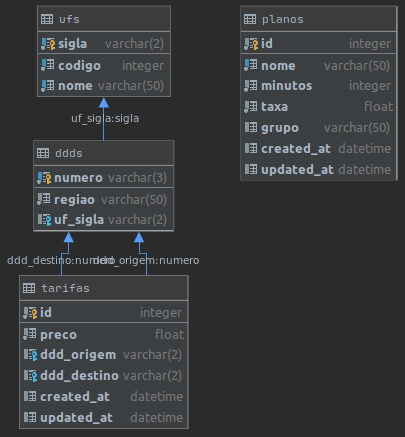

# Vizir

Resolução do desafio "Show me the code".

- Linguagem escolhida: [**JavaScript**](https://developer.mozilla.org/pt-BR/docs/Web/JavaScript);
  - **Porque**: é a terceira linguagem que mais domino (atrás de PHP e Python, respectivamente segundo e primeiro). Normalmente utilizo-o para aplicações mais simples, como foi o caso desse desafio.
- Framework front-end: [**React.JS**](https://pt-br.reactjs.org/);
  - **Porque**: dos frameworks para front-end, React.JS é o que mais tenho usado desde o ano passado. Possuo mais experiência com JQuery, porém venho deixando de usa-lo com o passar dos tempos. Outro grande motivo é que normalmente os membros de equipe que já tive usam React Native para programar aplicativos mobile, dessa forma da para trabalhar uma reutilização de componentes entre os sistemas web e mobile.
  - **Observação**: minha especialidade não é front-end, poucos foram os componentes criados do zero por mim, portanto fiz uso de um template (Material Kit React) para a facilitar a construção da página.
- Framework back-end: [**Adonis.JS**](https://adonisjs.com/);
  - **Porque**: dos frameworks para back-end, Adonis.JS foi o que mais me cativou, principalmente por os padrões MVC (Model, View e Controller) e GoF (Gang of Four), padrões adotados pelo Laravel, framework que possuo mais experiência.
- Banco de dados: [**SQLite**](https://www.sqlite.org/index.html).
  - **Porque**: utilizo SQLite para aplicações mais simples, como foi o caso desse desafio. Para aplicações mais robustas, normalmente utilizo PostgresSQL.

## Client e Server

Existem duas pastas: `client` e `server`, a primeira com a aplicação em React.JS e a segunda com o back-end em Adonis.JS. Devido a isso, você deve ter [Node.JS](https://nodejs.org/en/) e NPM instalados na sua máquina. Caso não tenha, por favor instale-os. Eu utilizo Linux (especificamente Ubuntu), portanto os comandos que irei mostrar a seguir são para esse sistema operacional.

### Client
**Aviso**: primeiro execute o passo-a-passo do Server para só depois executar o passo-a-passo do Client. Essa seção ficou primeiro que a do Server apenas devido ao seu tamanho.

Estando na pasta raiz do projeto:

```bash
# Entrar na pasta do aplicativo
cd client/

# Instalar dependências
npm install

# Ativando o servidor
npm run start
## Espera-se que o aplicativo estará ativo no endereço 127.0.0.1:3000
```

A parte referente ao desafio estará no final da página, com um formulário pedindo os dados necessários e uma parte para visualizar os valores com ou sem o plano FaleMais. Utilize as rotas da API para gerenciar os valores.

### Server
Estando na pasta raiz do projeto:

```bash
# Entrar na pasta do servidor
cd server/

# Instalar dependências
npm install

# Variáves de ambiente
cp .env.example .env
## Altere no arquivo .env as variáveis desejaveis de ambiente.
## Eu alterei o .env.example para ficar do mesmo jeito que estava usando na minha máquina

# Crie a chave da api
adonis key:generate

# Criando as tabelas no banco de dados
adonis migration:run

# Povoando o banco de dados
adonis seed --files='UfSeeder.js, DddSeeder.js, TarifaSeeder.js, PlanoSeeder.js'

# Ativando o servidor
adonis server
## Espera-se que a api estará ativa no endereço 127.0.0.1:3333 
```

#### Banco de dados



Foi criado um total de 4 tabelas:

- **ufs**: contêm os dados das unidades federativas do Brasil. É alimentado por um seed no servidor;
- **ddds**: contêm os dados dos DDDs atendidos pela Telzir. Possuem as operações de CRUD no servidor;
- **tarifas**: contêm os dados das tarifas atribuídas para cada tipo de ligação. Possuem as operações de CRUD no servidor;
- **planos**: contêm os dados dos planos disponíveis pela Telzir. Possuem as operações de CRUD no servidor;

Para trabalhos futuros, seria interessante implementar _soft delete_ nas tabelas.

Além dessas tabelas, foram criadas: *adonis_schema*, *sqlite_sequence* e *sqlite_master*, porém são tabelas criadas automaticamente pelo Adonis.JS e SQLite, portanto não foram inseridas nesse documento.

#### Rotas
Toda a aplicação (client e server) foi pensada e desenvolvida o mais próximo de uma aplicação real, logo você poderá usar as rotas listadas mais a frente para realizar as alterações que desejar e ver como a página do FaleMais se molda.

Foram criados um total de 18 rotas, sendo elas:
- Ufs
  - Listar: `[GET] /ufs`
- DDDs
  - Listar: `[GET] /ddds`
  - Registrar: `[POST] /ddds`
  - Visualizar: `[GET] /ddds/:id`
  - Atualizar: `[PUT] /ddds/:id`
  - Apagar: `[DELETE] /ddds/:id`
- Tarifas
  - Listar: `[GET] /tarifas`
  - Registrar: `[POST] /tarifas`
  - Visualizar: `[GET] /tarifas/:id`
  - Atualizar: `[PUT] /tarifas/:id`
  - Apagar: `[DELETE] /tarifas/:id`
  - DDDs: `[GET] /tarifas_ddds?field=:field&where=:where`
- Planos
  - Listar: `[GET] /planos`
  - Registrar: `[POST] /planos`
  - Visualizar: `[GET] /planos/:id`
  - Atualizar: `[PUT] /planos/:id`
  - Apagar: `[DELETE] /planos/:id`
- Simulação
  - Simular: `[GET] /simular`

O arquivo [FaleMais_2020-06-29.json](FaleMais_2020-06-29.json) é o workspace que utilizei no Insomnia para verificar as rotas, testar, etc.

----------

##### UFs
- Prefixo: `ufs`
- Observação: como os dados de UFs já são povoados no banco e são dados que são alterados raramente, optou-se por ter apenas a rota de listagem para consulta.

**Listar**:
`[GET] /ufs`

Exemplo de retorno:
```json
[
  {
    "codigo": 11,
    "sigla": "RO",
    "nome": "Rondônia"
  },
  {
    "codigo": 12,
    "sigla": "AC",
    "nome": "Acre"
  },
  {
    "codigo": 13,
    "sigla": "AM",
    "nome": "Amazonas"
  },
  // ...
]
```

----------

##### DDDs
- Prefixo: `ddds`

**Listar**:
`[GET] /ddds`

Exemplo de response:
```json
{
  "message": "",
  "data": [
    {
      "numero": "011",
      "regiao": "São Paulo",
      "uf_sigla": "SP"
    },
    {
      "numero": "016",
      "regiao": "Ribeirão Preto",
      "uf_sigla": "SP"
    },
    {
      "numero": "017",
      "regiao": "São José do Rio Preto",
      "uf_sigla": "SP"
    },
    // ...
  ],
  "error": {}
}
```

**Registrar**:
`[POST] /ddds`

- **Body**

| Campo | Tipo | Obrigatório | Especificações |
| ----- | ---- | ----------- | -------------- |
| `numero` | string | Sim | Mínimo de 3 e máximo de 3 caracteres, deve ser único nos DDDs. |
| `regiao` | string | Sim | Mínimo de 1 e máximo de 50 caracteres. |
| `uf_sigla` | string | Sim | Deve ser uma sigla de UF válida. |

Exemplo de request:
```json
{
  "numero": "084",
  "regiao": "Auto Oeste",
  "uf_sigla": "RN"
}
```

Exemplo de response:
```json
{
  "message": "DDD salvo com sucesso!",
  "data": {
    "numero": "084",
    "regiao": "Auto Oeste",
    "uf_sigla": "RN"
  },
  "error": {}
}
```

**Visualizar**:
`[GET] /ddds/:id`

Exemplo de response:
```json
{
  "message": "",
  "data": {
    "numero": "016",
    "regiao": "Ribeirão Preto",
    "uf_sigla": "SP",
    "uf": {
      "codigo": 35,
      "sigla": "SP",
      "nome": "São Paulo"
    },
    "tarifas_origem": [
      {
        "preco": 2.9,
        "ddd_origem": "016",
        "ddd_destino": "011"
      }
    ],
    "tarifas_destino": [
      {
        "preco": 1.9,
        "ddd_origem": "011",
        "ddd_destino": "016"
      }
    ]
  },
  "error": {}
}
```

**Atualizar**:
`[PUT] /ddds/:id`

- **Body**

| Campo | Tipo | Obrigatório | Especificações |
| ----- | ---- | ----------- | -------------- |
| `numero` | string | Não | Mínimo de 3 e máximo de 3 caracteres, deve ser único nos DDDs. |
| `regiao` | string | Não | Mínimo de 1 e máximo de 50 caracteres. |
| `uf_sigla` | string | Não | Deve ser uma sigla de UF válida. |

Exemplo de request:
```json
{
  "numero": "092"
}
```

Exemplo de response:
```json
{
  "message": "DDD atualizado com sucesso.",
  "data": {
    "numero": "092",
    "regiao": "Auto Oeste",
    "uf_sigla": "RN"
  },
  "error": {}
}
```

**Apagar**:
`[DELETE] /ddds/:id`

Exemplo de response:
```json
{
  "message": "DDD 092 apagado com sucesso.",
  "data": {},
  "error": {}
}
```

----------

##### Tarifas
- Prefixo: `tarifas`

**Listar**:
`[GET] /tarifas`

Exemplo de response:
```json
{
  "message": "",
  "data": [
    {
      "id": 1,
      "preco": 1.9,
      "ddd_origem": "011",
      "ddd_destino": "016",
      "created_at": "2020-06-28 15:56:01",
      "updated_at": "2020-06-28 15:56:01"
    },
    {
      "id": 3,
      "preco": 1.7,
      "ddd_origem": "011",
      "ddd_destino": "017",
      "created_at": "2020-06-28 15:56:01",
      "updated_at": "2020-06-28 15:56:01"
    },
    {
      "id": 5,
      "preco": 0.9,
      "ddd_origem": "011",
      "ddd_destino": "018",
      "created_at": "2020-06-28 15:56:01",
      "updated_at": "2020-06-28 15:56:01"
    },
    // ...
  ],
  "error": {}
}
```

**Registrar**:
`[POST] /tarifas`

- **Body**

| Campo | Tipo | Obrigatório | Especificações |
| ----- | ---- | ----------- | -------------- |
| `preco` | float | Sim | - |
| `ddd_origem` | string | Sim | Deve ser o número de um DDD válido. |
| `ddd_destino` | string | Sim | Deve ser o número de um DDD válido. |

Exemplo de request:
```json
{
  "ddd_origem": "011",
  "ddd_destino": "084",
  "preco": 1.9
}
```

Exemplo de response:
```json
{
  "message": "Tarifa registrada com sucesso!",
  "data": {
    "preco": 1.9,
    "ddd_origem": "011",
    "ddd_destino": "084"
  },
  "error": {}
}
```

**Visualizar**:
`[GET] /tarifas/:id`

Exemplo de response:
```json
{
  "message": "",
  "data": {
    "preco": 1.9,
    "ddd_origem": "011",
    "ddd_destino": "084",
    "origem": {
      "numero": "011",
      "regiao": "São Paulo",
      "uf_sigla": "SP"
    },
    "destino": {
      "numero": "084",
      "regiao": "teste",
      "uf_sigla": "RN"
    }
  },
  "error": {}
}
```

**Atualizar**:
`[PUT] /tarifas/:id`

- **Body**

| Campo | Tipo | Obrigatório | Especificações |
| ----- | ---- | ----------- | -------------- |
| `preco` | float | Não | - |
| `ddd_origem` | string | Não | Deve ser o número de um DDD válido. |
| `ddd_destino` | string | Não | Deve ser o número de um DDD válido. |

Exemplo de request:
```json
{
  "preco": 2.1
}
```

Exemplo de response:
```json
{
  "message": "Tarifa de 011 para 084 atualizada com sucesso.",
  "data": {
    "preco": 2.1,
    "ddd_origem": "011",
    "ddd_destino": "084"
  },
  "error": {}
}
```

**Apagar**:
`[DELETE] /tarifas/:id`

Exemplo de response:
```json
{
  "message": "Tarifa de 011 para 084 apagado com sucesso.",
  "data": {},
  "error": {}
}
```

**DDDs**:
`[GET] /tarifas_ddds?field=:field&where=:where`

- **Parâmetros**:
  - `field`: indica qual campo na tabela `tarifas` será usado para fazer a seleção;
  - `where`: é um json que indica qual campo será usado para realizar uma cláusula _where_ na consulta de seleção.

Exemplos de retorno:
```json
// /tarifas_ddds?field=ddd_origem&where={}
{
  "message": "",
  "data": [
    {
      "ddd_origem": "011"
    },
    {
      "ddd_origem": "016"
    },
    {
      "ddd_origem": "017"
    },
    {
      "ddd_origem": "018"
    }
  ],
  "error": {}
}
```

```json
// /tarifas_ddds?field=ddd_destino&where={"field":"ddd_origem","value":"011"}
{
  "message": "",
  "data": [
    {
      "ddd_destino": "016"
    },
    {
      "ddd_destino": "017"
    },
    {
      "ddd_destino": "018"
    }
  ],
  "error": {}
}
```

----------

##### Planos
- Prefixo: `planos`

**Listar**:
`[GET] /planos`

Exemplo de response:
```json
// /planos?group=FaleMais
{
  "message": "",
  "data": [
    {
      "id": 1,
      "created_at": "2020-06-28 15:55:59",
      "updated_at": "2020-06-28 15:55:59",
      "nome": "FaleMais 30",
      "minutos": 30,
      "taxa": 1.1,
      "grupo": "FaleMais"
    },
    {
      "id": 2,
      "created_at": "2020-06-28 15:56:01",
      "updated_at": "2020-06-28 15:56:01",
      "nome": "FaleMais 60",
      "minutos": 60,
      "taxa": 1.1,
      "grupo": "FaleMais"
    },
    {
      "id": 3,
      "created_at": "2020-06-28 15:56:01",
      "updated_at": "2020-06-28 15:56:01",
      "nome": "FaleMais 120",
      "minutos": 120,
      "taxa": 1.1,
      "grupo": "FaleMais"
    }
  ],
  "error": {}
}
```

**Registrar**:
`[POST] /planos`

- **Body**

| Campo | Tipo | Obrigatório | Especificações |
| ----- | ---- | ----------- | -------------- |
| `nome` | string | Sim | Mínimo de 1 e máximo de 50 caracteres, deve ser único nos planos. |
| `minutos` | int | Sim | - |
| `taxa` | float | Sim | - |
| `grupo` | string | Não | Máximo de 50 caracteres. |

Exemplo de request:
```json
{
  "nome": "Teste piloto",
  "minutos": 25,
  "taxa": 1.5,
  "grupo": "FaleMais"
}
```

Exemplo de response:
```json
{
  "message": "Plano registrado com sucesso!",
  "data": {
    "nome": "Teste Piloto",
    "minutos": 25,
    "taxa": 1.5,
    "grupo": "FaleMais"
  },
  "error": {}
}
```

**Visualizar**:
`[GET] /planos/:id`

Exemplo de response:
```json
{
  "message": "",
  "data": {
    "nome": "Teste Piloto",
    "minutos": 25,
    "taxa": 1.5,
    "grupo": "FaleMais"
  },
  "error": {}
}
```

**Atualizar**:
`[PUT] /planos/:id`

- **Body**

| Campo | Tipo | Obrigatório | Especificações |
| ----- | ---- | ----------- | -------------- |
| `nome` | string | Não | Mínimo de 1 e máximo de 50 caracteres, deve ser único nos planos. |
| `minutos` | int | Não | - |
| `taxa` | float | Não | - |
| `grupo` | string | Não | Máximo de 50 caracteres. |

Exemplo de request:
```json
{
  "minutos": 250
}
```

Exemplo de response:
```json
{
  "message": "Plano Teste Piloto atualizado com sucesso.",
  "data": {
    "nome": "011",
    "minutos": 250,
    "taxa": 1.5,
    "grupo": "FaleMais"
  },
  "error": {}
}
```

**Apagar**:
`[DELETE] /planos/:id`

Exemplo de response:
```json
{
  "message": "Plano Teste Piloto apagado com sucesso.",
  "data": {},
  "error": {}
}
```

----------

##### Simulação
- Prefixo: `simulacao`

**Simular**:
`[POST simulacao]`

Exemplo de request:
```json
{
  "codigo_origem": "018",
  "codigo_destino": "017",
  "minutos": 100,
  "plano_id": 1
}
```

Exemplo de response:
```json
{
  "message": "",
  "data": {
    "sem_plano": "190.00",
    "com_plano": "146.30"
  },
  "error": {}
}
```
